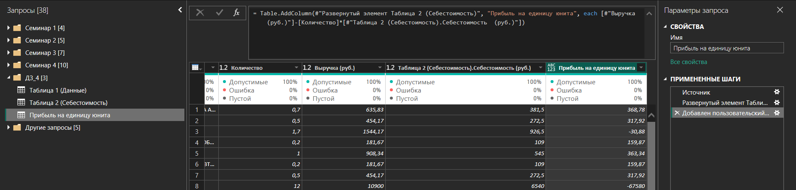
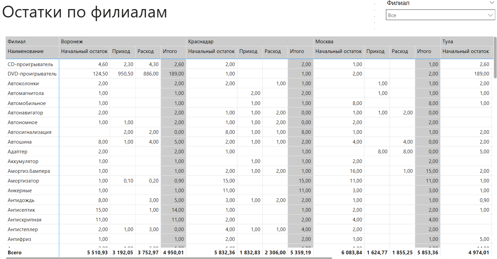
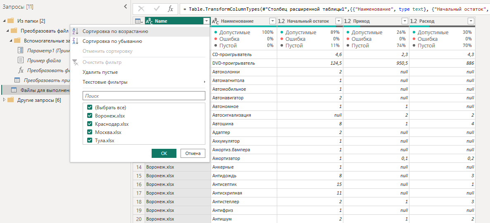
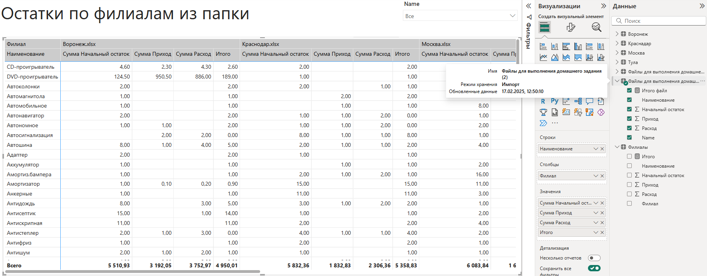
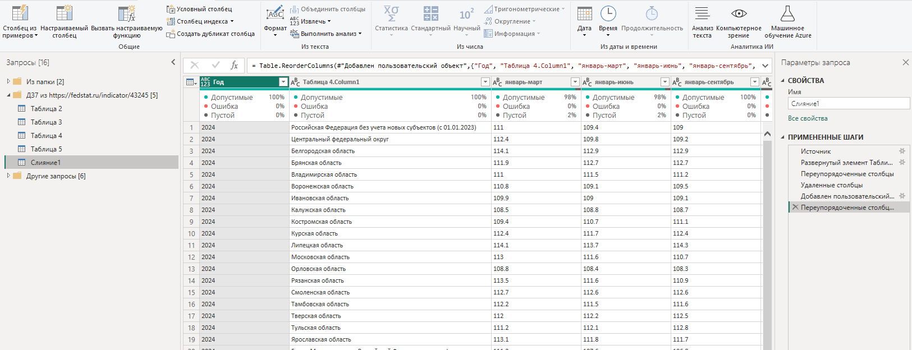
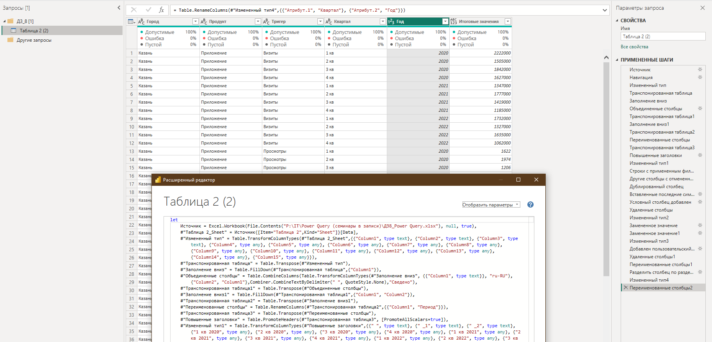

# PowerQueryGB

## Урок 1. Основные функции
Сделайте типизацию признака услуги, где одинаковые работы названы идентично и сделайте отдельную таблицу с группировкой по уникальным услугам и стоимостью продаж.

## Урок 2. Добавление новых столбцов. Часть 1
Сделайте столбец из примеров для столбца Source из маркетинговых данных, чтобы одинаковые источники трафика были объединены в 1 признак (например yandex и yandex.ru = yandex, а все сайты компании как сайт).

## Урок 3. Добавление новых столбцов. Часть 2
Скачайте данные, прикрепленные к уроку.

1. Выведите признак НДС по строкам - где он 18%, а где 20%.
2. Посчитайте возраст людей из второй таблицы.

## Урок 4. Объединение таблиц. Часть 1
Сделайте объединение данных из приложенного файла: Автодилер — выручка и себестоимость (ДЗ), и рассчитайте прибыль на единицу юнита.

## Урок 5. Объединение таблиц. Часть 2
Создайте отчёт в формате дашборда на основе dataset из нескольких Excel-файлов.

Файлы содержат информацию о наличии и расходах аксессуаров от каждого из дилерских центров. Файлы обновляются ежедневно менеджерами дилерских центров.

Добавьте признак филиала.

В дашборде должна аккумулироваться статистика по наличию аксессуаров во всей дилерской сети. Из дашборда нужно сделать пример ежедневной выгрузки для менеджера по закупкам центрального офиса.

## Урок 6. Транспонирование данных, группировка. Часть 1
В таблицу из предыдущего домашнего задания, где мы объединяли запросы методом append, добавьте столбец с признаком филиала из названия файла.

Импорт из папки:

Построение дашборда:

## Урок 7. Транспонирование данных, группировка. Часть 2
https://fedstat.ru/indicator/43245

ЕМИСС (fedstat.ru) — по ссылке загрузите таблицу на уровень Power BI таким образом, чтобы воссоздать таблицу ниже:

Результат слияния таблиц из интернет источника:

## Урок 8. Язык М
Преобразуйте в табличный вид данные из эксель файла (файл “ДЗ к 8 семинару Power Query”)

~~~
let
    Источник = Excel.Workbook(File.Contents("P:\IT\Power Query (семинары в записи)\ДЗ8_Power Query.xlsx"), null, true),
    #"Таблица 2_Sheet" = Источник{[Item="Таблица 2",Kind="Sheet"]}[Data],
    #"Измененный тип" = Table.TransformColumnTypes(#"Таблица 2_Sheet",{{"Column1", type text}, {"Column2", type text}, {"Column3", type text}, {"Column4", type any}, {"Column5", type any}, {"Column6", type any}, {"Column7", type any}, {"Column8", type any}, {"Column9", type any}, {"Column10", type any}, {"Column11", type any}, {"Column12", type any}, {"Column13", type any}, {"Column14", type any}, {"Column15", type any}}),
    #"Транспонированная таблица" = Table.Transpose(#"Измененный тип"),
    #"Заполнение вниз" = Table.FillDown(#"Транспонированная таблица",{"Column1"}),
    #"Объединенные столбцы" = Table.CombineColumns(Table.TransformColumnTypes(#"Заполнение вниз", {{"Column1", type text}}, "ru-RU"),{"Column2", "Column1"},Combiner.CombineTextByDelimiter(" ", QuoteStyle.None),"Сведено"),
    #"Транспонированная таблица1" = Table.Transpose(#"Объединенные столбцы"),
    #"Заполнение вниз1" = Table.FillDown(#"Транспонированная таблица1",{"Column1", "Column2"}),
    #"Транспонированная таблица2" = Table.Transpose(#"Заполнение вниз1"),
    #"Переименованные столбцы" = Table.RenameColumns(#"Транспонированная таблица2",{{"Column1", "Период"}}),
    #"Транспонированная таблица3" = Table.Transpose(#"Переименованные столбцы"),
    #"Повышенные заголовки" = Table.PromoteHeaders(#"Транспонированная таблица3", [PromoteAllScalars=true]),
    #"Измененный тип1" = Table.TransformColumnTypes(#"Повышенные заголовки",{{" ", type text}, {" _1", type text}, {" _2", type text}, {"1 кв 2020", type any}, {"2 кв 2020", type any}, {"3 кв 2020", type any}, {"4 кв 2020", type any}, {"1 кв 2021", type any}, {"2 кв 2021", type any}, {"3 кв 2021", type any}, {"4 кв 2021", type any}, {"1 кв 2022", type any}, {"2 кв 2022", type any}, {"3 кв 2022", type any}, {"4 кв 2022", type any}}),
    #"Строки с примененным фильтром" = Table.SelectRows(#"Измененный тип1", each true),
    #"Другие столбцы с отмененным свертыванием" = Table.UnpivotOtherColumns(#"Строки с примененным фильтром", {" ", " _1", " _2"}, "Атрибут", "Значение"),
    #"Дублированный столбец" = Table.DuplicateColumn(#"Другие столбцы с отмененным свертыванием", "Значение", "Копия Значение"),
    #"Вставленные последние символы" = Table.AddColumn(#"Дублированный столбец", "Последние символы", each Text.End(Text.From([Копия Значение], "ru-RU"), 1), type text),
    #"Условный столбец добавлен" = Table.AddColumn(#"Вставленные последние символы", "Коэф", each if [Последние символы] = "M" then 1000000 else if [Последние символы] = "k" then 1000 else 1),
    #"Удаленные столбцы" = Table.RemoveColumns(#"Условный столбец добавлен",{"Последние символы"}),
    #"Измененный тип2" = Table.TransformColumnTypes(#"Удаленные столбцы",{{"Копия Значение", type text}}),
    #"Замененное значение" = Table.ReplaceValue(#"Измененный тип2","M","",Replacer.ReplaceText,{"Копия Значение"}),
    #"Замененное значение1" = Table.ReplaceValue(#"Замененное значение","k","",Replacer.ReplaceText,{"Копия Значение"}),
    #"Измененный тип3" = Table.TransformColumnTypes(#"Замененное значение1",{{"Коэф", Int64.Type}, {"Копия Значение", type number}}),
    #"Добавлен пользовательский объект" = Table.AddColumn(#"Измененный тип3", "Итоговые значения", each [Копия Значение]*[Коэф]),
    #"Удаленные столбцы1" = Table.RemoveColumns(#"Добавлен пользовательский объект",{"Значение", "Копия Значение", "Коэф"})
in
    #"Удаленные столбцы1"
~~~